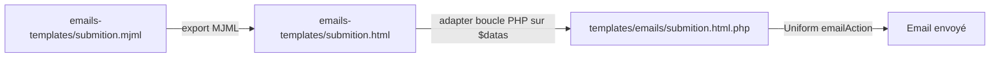

# Documentation technique

Référence interne du plugin `baptiste/kirby-form-snippets`. Pour l'utilisation au quotidien, voir [README.md](../README.md) et [examples.md](examples.md).

## Architecture

```
site/config/config.php          → baptiste.kirby-form-snippets.forms.{formKey}
        │
        ▼
repliq_form($formKey, $overrides)  → helpers.php → RepliqForm::fromKey()
        │
        ├── buildConfig()             → config + hook + overrides
        ├── formConfig (RepliqForm)   → champs + règles Uniform (vide en mode filter)
        ├── form (Uniform\Form | RepliqFilterState)
        ├── formKey
        ├── formAction                → URL POST plugin | URL page courante (filter)
        └── mode                      → submit | filter
        │
        ▼
snippet form-page / form-filter / form-fields
        │
        ▼ POST (submit) ou GET (filter)
route kirby-form-snippets/submit/{formKey}     (submit uniquement)
        │
        ▼
RepliqForm::handleSubmit()  → validation Uniform + emailAction()
```

## Point d'entrée

Fichier : `index.php`

| Extension | Rôle |
|-----------|------|
| `options` | Placeholder, messages, limites, routes, registre `forms` |
| `routes` | GET token CSRF, POST soumission par `formKey` |
| `snippets` | Markup champs et wrappers |
| `blueprints` | Block `blocks/contact-form` |
| `templates` | Email `emails/submition.html` |

| Classe / helper | Fichier | Rôle |
|-----------------|---------|------|
| `repliq\RepliqForm` | `classes/form.php` | Config, règles, submit, `optionsFrom`, `toFrom` |
| `repliq\RepliqFilterState` | `classes/filter-state.php` | État GET (mode filter) |
| `repliq_form()` | `helpers.php` | API publique de rendu |

## Modes

| `mode` | Méthode | Snippet | CSRF | Honeypot | Email | Filtrage collection |
|--------|---------|---------|------|----------|-------|---------------------|
| `submit` (défaut) | POST | `form-page` | oui | oui | oui | — |
| `filter` | GET | `form-filter` | non | ignoré | non | **template / controller du site** |

## Résolution de la config

Ordre dans `RepliqForm::buildConfig()` :

1. Config de base (`baptiste.kirby-form-snippets.forms.{formKey}`)
2. Hook `repliq.form.config` — `$context` = `render` ou `submit`
3. Overrides passés à `repliq_form($key, $overrides)` (priorité max à l'affichage)

Puis, à l'instanciation de `RepliqForm` :

- `resolveFields()` — fusionne `options` + `optionsFrom` (statiques en premier)
- `resolveEmailConfig()` — résout `toFrom` à la soumission POST uniquement

### Fusion des overrides

| Clé | Comportement |
|-----|--------------|
| `fields.{id}` | merge récursif |
| `fields.{id}.options` | **remplace** entièrement si fourni |
| `email` | merge récursif |
| `mode` | override gagne |

Le hook avec `$context === 'submit'` est requis pour synchroniser options dynamiques et `email.to` : la route POST n'exécute pas le controller.

## `optionsFrom` — résolution

Implémenté dans `RepliqForm::resolveOptions()`.

| `type` | Paramètres | Source |
|--------|------------|--------|
| `pages` | `parent`, `label` (défaut `title`), `value` (défaut `slug`) | `$parent->children()->listed()` |
| `structure` | `field`, `page` (défaut `site`), `label` / `value` | `$page->{$field}()->toStructure()` |
| callable | — | Retour `[ ['label' => '…', 'value' => '…'], … ]` |

Seuls `label` et `value` sont transmis aux snippets. Les autres colonnes d'une structure Panel ne sont pas rendues.

Valeur d'option : `value` explicite, sinon slug du `label` (`RepliqForm::optionValue()`).

## `toFrom` — résolution

Implémenté dans `RepliqForm::resolveEmailConfig()` et `resolveEmailTo()`.

| Forme | Usage |
|-------|--------|
| `'to' => 'email@…'` | Destinataire statique |
| `'toFrom' => 'site.contactEmail'` | Chemin champ Kirby |
| `'toFrom' => [ 'field' => '…', 'match' => 'formKey', 'value' => 'email', 'page' => 'site' ]` | Structure Panel, match sur `formKey` |
| `'toFrom' => fn (string $formKey): string\|array => …` | Callable (ex. match sur `get('subject')`) |

Fallback si `toFrom` ne résout rien et pas de `to` : `baptiste.kirby-form-snippets.defaultEmailTo`.

## Validation Uniform

Règles générées par `RepliqForm::getRules()` :

| `input` | Règles |
|---------|--------|
| `input` | `required`, `email`, `tel`, `maxLength` |
| `textarea` | `required`, `maxLength` |
| `select` | `required`, `in:…` |
| `select` (multiselect) | `notEmpty`, `in:…` (tableau) |
| `radio-group` | `required`, `in:…` |
| `checkbox` | `required` si obligatoire |
| `checkbox-group` | `notEmpty` si obligatoire, `in:…` |
| `honeypot` | `HoneypotGuard` Uniform (voir soumission POST) |
| `line`, `card`, `section-title` | aucune |

## Chaîne de rendu

### `form-page`

| Paramètre | Défaut |
|-----------|--------|
| `formKey` | obligatoire |
| `overrides` | — |
| `formData` | — |
| `formClass` | `repliq-form-{formKey}` |
| `formSelector` | `.{formClass}` |
| `submitLabel` | `Envoyer` |
| `successMessage` | message de remerciement |

Succès Uniform → message ; sinon → `<form method="post" action="{submitUrl}">`.

### `form-filter`

| Paramètre | Défaut |
|-----------|--------|
| `formKey` | obligatoire (`mode` => `filter`) |
| `overrides` | — |
| `formData` | — |
| `formClass` | `repliq-form-{formKey}` |
| `submitLabel` | `Filtrer` |
| `formActionOverride` | URL page courante |

Pré-remplit les champs via `get()`. Pas de validation serveur.

### `form-fields`

1. `form-csrf` + `form-csrf-refresh` — si `mode !== 'filter'`
2. Boucle `RepliqForm::getInputs($form)`

Snippets utilitaires : `form-label`, `form-info`, `form-field-errors`.

## Soumission POST

Route : `{submit.route}/{formKey}` (défaut : `kirby-form-snippets/submit/{formKey}`).

Flux `RepliqForm::handleSubmit($key)` :

1. `buildConfig($key, [], 'submit')` + hook
2. `new Form($formConfig->getRules())`
3. `honeypotGuard(['field' => …])` si un champ `honeypot` est déclaré (nom = clé ou `name`)
4. `resolveEmailConfig()` — `toFrom`, `defaultEmailTo`, `defaultEmailTemplate`
5. `$form->emailAction($emailConfig)->done()`

Uniform expose `old()`, `error()`, `success()` pour le re-rendu.

## CSRF

| Option | Défaut |
|--------|--------|
| `csrf.route` | `kirby-form-snippets/csrf-token` |
| `csrf.field` | `csrf_token` |
| `csrf.formSelector` | `form` |

Route GET → `{ "token": "…" }`. `form-csrf-refresh` met à jour les champs hidden (important si plusieurs formulaires : `formSelector` unique par instance).

## Hook `repliq.form.config`

```php
'hooks' => [
    'repliq.form.config' => function (array $config, string $formKey, string $context): array {
        // $context : 'render' | 'submit'
        return $config;
    },
],
```

## Options du plugin

Préfixe : `baptiste.kirby-form-snippets.`

| Clé | Rôle |
|-----|------|
| `forms` | Registre des formulaires |
| `placeholder` | Placeholder inputs/textarea |
| `maxLength.input` / `.textarea` | Limites caractères (validation + attribut HTML `maxlength`) |
| `messages.*` | Messages d'erreur Uniform |
| `csrf.*` | Route et sélecteurs CSRF |
| `submit.route` | Préfixe URL soumission |
| `defaultEmailTo` | Fallback `toFrom` |
| `defaultEmailTemplate` | Template email Uniform si absent de la config (`emails/submition.html`) |

Clés `messages.*` : `required`, `requiredSelect`, `requiredCheckbox`, `requiredCheckboxGroup`, `requiredRadioGroup`, `email`, `tel`, `maxLengthInput`, `maxLengthTextarea`, `honeypot`, `in`.

## Block Panel

- Blueprint : `blueprints/blocks/contact-form.yml`
- Snippet : `snippets/blocks/contact-form.php` → délègue à `form-page`

## Template email

### Flux de maintenance



| Fichier | Rôle |
|---------|------|
| `emails-templates/submition.mjml` | Maquette MJML (placeholders statiques) |
| `emails-templates/submition.html` | Export HTML de référence — **non chargé** à l'exécution |
| `templates/emails/submition.html.php` | Template Kirby réel, enregistré comme `emails/submition.html` |

Pour modifier le design : éditer le MJML, exporter en HTML, reprendre manuellement la structure dans le `.php` (boucle `foreach ($datas as …)`). Ne pas ré-exporter le HTML par-dessus le `.php`.

### Variables du template

- `$formName`, `$date`, `$datas` (label / value / input par champ)
- Les `checkbox-group` sont rendus en liste `<ul>` dans le template PHP

### Configuration

Par défaut, `resolveEmailConfig()` applique `defaultEmailTemplate` (`emails/submition.html`) si `email.template` est absent. Surcharge possible par formulaire ou via l'option plugin.

## Arborescence

```
index.php
helpers.php
classes/form.php
classes/filter-state.php
docs/
  README.md
  inputs.md
  examples.md
  tech.md
snippets/
  form-page.php
  form-filter.php
  form-fields.php
  form-csrf-refresh.php
  fields/
  blocks/contact-form.php
blueprints/blocks/contact-form.yml
blueprints/examples/site-form-settings.yml
templates/emails/submition.html.php
```

## Dépendances

- Kirby 3.5+ / 4 / 5
- `mzur/kirby-uniform` ^5.0
- `getkirby/composer-installer`

## Voir aussi

- [README.md](../README.md) — installation et démarrage
- [inputs.md](inputs.md) — référence des champs
- [examples.md](examples.md) — scénarios d'implémentation
