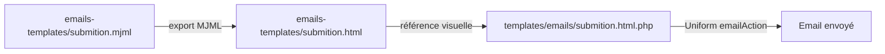

# Documentation technique

Référence interne du plugin `baptiste/kirby-form-snippets`. Pour l'utilisation au quotidien, voir [README.md](../README.md) et [examples.md](examples.md).

## Architecture

```
site/config/config.php          → baptiste.kirby-form-snippets.forms.{formKey}
        │
        ▼
repliq_form($formKey, $overrides)  → helpers.php → RepliqForm::fromKey()
        │
        ├── buildConfig()             → config + hook + overrides
        ├── formConfig (RepliqForm)   → champs + règles Uniform (vide en mode filter)
        ├── form (Uniform\Form | RepliqFilterState)
        ├── formKey
        ├── formAction                → URL POST plugin | URL page courante (filter)
        ├── mode                      → submit | filter
        └── honeytime                 → options guard Honeytime | null
        │
        ▼
snippet form-page / form-filter / form-fields
        │
        ▼ POST (submit) ou GET (filter)
route kirby-form-snippets/submit/{formKey}     (submit uniquement)
        │
        ▼
RepliqForm::handleSubmit()  → validation Uniform + guards (honeypot, honeytime) + emailAction()
```

## Point d'entrée

Fichier : `index.php`

| Extension | Rôle |
|-----------|------|
| `options` | Placeholder, messages, limites, routes, honeytime, registre `forms` |
| `routes` | GET token CSRF, GET timestamp Honeytime, POST soumission par `formKey` |
| `snippets` | Markup champs et wrappers |
| `blueprints` | Block `blocks/contact-form` |
| `templates` | Email `emails/submition.html` |
| `translations` | Messages FR des guards Uniform (`uniform-honeytime-*`) |

| Classe / helper | Fichier | Rôle |
|-----------------|---------|------|
| `repliq\RepliqForm` | `classes/form.php` | Config, règles, submit, `optionsFrom`, `toFrom` |
| `repliq\RepliqFilterState` | `classes/filter-state.php` | État GET (mode filter) |
| `repliq_form()` | `helpers.php` | API publique de rendu |

## Modes

| `mode` | Méthode | Snippet | CSRF | Honeypot | Honeytime | Email | Filtrage collection |
|--------|---------|---------|------|----------|-----------|-------|---------------------|
| `submit` (défaut) | POST | `form-page` | oui | si champ déclaré | si activé | oui | — |
| `filter` | GET | `form-filter` | non | ignoré | ignoré | non | **template / controller du site** |

## Résolution de la config

Ordre dans `RepliqForm::buildConfig()` :

1. Config de base (`baptiste.kirby-form-snippets.forms.{formKey}`)
2. Hook `repliq.form.config` — `$context` = `render` ou `submit`
3. Overrides passés à `repliq_form($key, $overrides)` (priorité max à l'affichage)

Puis, à l'instanciation de `RepliqForm` :

- `resolveFields()` — fusionne `options` + `optionsFrom` (statiques en premier)
- `resolveEmailConfig()` — résout `toFrom` à la soumission POST uniquement

### Fusion des overrides

| Clé | Comportement |
|-----|--------------|
| `fields.{id}` | merge récursif |
| `fields.{id}.options` | **remplace** entièrement si fourni |
| `email` | merge récursif |
| `mode` | override gagne |
| `honeytime` | override gagne (`true`, `false` ou tableau d'options) |

Le hook avec `$context === 'submit'` est requis pour synchroniser options dynamiques et `email.to` : la route POST n'exécute pas le controller.

## `optionsFrom` — résolution

Implémenté dans `RepliqForm::resolveOptions()`.

| `type` | Paramètres | Source |
|--------|------------|--------|
| `pages` | `parent`, `label` (défaut `title`), `value` (défaut `slug`) | `$parent->children()->listed()` |
| `structure` | `field`, `page` (défaut `site`), `label` / `value` | `$page->{$field}()->toStructure()` |
| callable | — | Retour `[ ['label' => '…', 'value' => '…'], … ]` |

Seuls `label` et `value` sont transmis aux snippets. Les autres colonnes d'une structure Panel ne sont pas rendues.

Valeur d'option : `value` explicite, sinon slug du `label` (`RepliqForm::optionValue()`).

## `toFrom` — résolution

Implémenté dans `RepliqForm::resolveEmailConfig()` et `resolveEmailTo()`.

| Forme | Usage |
|-------|--------|
| `'to' => 'email@…'` | Destinataire statique |
| `'toFrom' => 'site.contactEmail'` | Chemin champ Kirby |
| `'toFrom' => [ 'field' => '…', 'match' => 'formKey', 'value' => 'email', 'page' => 'site' ]` | Structure Panel, match sur `formKey` |
| `'toFrom' => fn (string $formKey): string\|array => …` | Callable (ex. match sur `get('subject')`) |

Fallback si `toFrom` ne résout rien et pas de `to` : `baptiste.kirby-form-snippets.defaultEmailTo`.

## Validation Uniform

Règles générées par `RepliqForm::getRules()` :

| `input` | Règles |
|---------|--------|
| `input` | `required`, `email`, `tel`, `maxLength` |
| `textarea` | `required`, `maxLength` |
| `select` | `required`, `in:…` |
| `select` (multiselect) | `notEmpty`, `in:…` (tableau) |
| `radio-group` | `required`, `in:…` |
| `checkbox` | `required` si obligatoire |
| `checkbox-group` | `notEmpty` si obligatoire, `in:…` |
| `honeypot` | `HoneypotGuard` Uniform (voir soumission POST) |
| `line`, `card`, `section-title` | aucune |

## Chaîne de rendu

### `form-page`

| Paramètre | Défaut |
|-----------|--------|
| `formKey` | obligatoire |
| `overrides` | — |
| `formData` | — |
| `formClass` | `repliq-form-{formKey}` |
| `formSelector` | `.{formClass}` |
| `submitLabel` | `Envoyer` |
| `successMessage` | message de remerciement |
| `errorsSummary` | — (bool ou `['title' => '…']`) ; sinon option globale / par formulaire |
| `htmx` | — (bool ou tableau) ; sinon option globale / par formulaire |

Succès Uniform → message ; sinon → `<form method="post" action="{submitUrl}">`. Si le récap d'erreurs est activé, `form-errors-summary` est rendu en tête du `<form>` (en plus des `notif.error` par champ).

Le contenu est enveloppé dans `<div id="repliq-form-{formKey}" class="repliq-form-container">` pour permettre le remplacement HTMX.

Option globale : `baptiste.kirby-form-snippets.errorsSummary` (`enabled`, `title`). Par formulaire : `errorsSummary => true` dans `forms.{formKey}`.

### HTMX (optionnel)

Soumission AJAX sans JavaScript custom via [htmx](https://htmx.org/). Désactivé par défaut.

**Activation**

| Niveau | Exemple |
|--------|---------|
| Global | `'htmx' => ['enabled' => true]` dans `baptiste.kirby-form-snippets` |
| Par formulaire | `'htmx' => true` dans `forms.{formKey}` |
| Par snippet | `snippet('form-page', ['formKey' => 'contact', 'htmx' => true])` |

**Comportement**

- Attributs `hx-post`, `hx-target`, `hx-swap` injectés sur le `<form>` quand HTMX est activé.
- La route `submit` détecte l'en-tête `HX-Request: true` et renvoie un fragment HTML (sans redirection) via `withoutRedirect()` / `withoutFlashing()` Uniform.
- Le script [htmx.org](https://htmx.org/) est chargé une fois par page (`form-htmx-script`) ; le rafraîchissement CSRF / Honeytime est géré via `htmx:afterSwap` (remplace les snippets `form-csrf-refresh` / `form-honeytime-refresh` en mode HTMX).
- Dégradation gracieuse : `action` + `method="post"` restent présents si JavaScript est désactivé.

**Options** (`baptiste.kirby-form-snippets.htmx`)

| Clé | Défaut | Rôle |
|-----|--------|------|
| `enabled` | `false` | Active HTMX sur tous les forms (sauf `htmx => false`) |
| `swap` | `outerHTML` | Valeur de `hx-swap` |
| `target` | `#repliq-form-{formKey}` | Sélecteur `hx-target` |
| `indicator` | `null` | Sélecteur `hx-indicator` (spinner, etc.) |
| `disabledElt` | `find button[type=submit]` | Élément désactivé pendant la requête |
| `loadScript` | `true` | Charge htmx.org depuis le CDN |
| `script` | CDN jsdelivr 2.0.10 | URL du script |
| `scriptIntegrity` | hash SRI | Attribut `integrity` |
| `scriptCrossorigin` | `anonymous` | Attribut `crossorigin` |

**Exemple**

```php
// site/config/config.php
'baptiste.kirby-form-snippets' => [
    'htmx' => ['enabled' => true],
    'forms' => [
        'contact' => [
            'htmx' => true,
            // ...
        ],
    ],
],
```

```php
// template
snippet('form-page', ['formKey' => 'contact', 'htmx' => true]);
```

### `form-filter`

| Paramètre | Défaut |
|-----------|--------|
| `formKey` | obligatoire (`mode` => `filter`) |
| `overrides` | — |
| `formData` | — |
| `formClass` | `repliq-form-{formKey}` |
| `submitLabel` | `Filtrer` |
| `formActionOverride` | URL page courante |

Pré-remplit les champs via `get()`. Pas de validation serveur.

### `form-fields`

1. `form-csrf` + `form-csrf-refresh` — si `mode !== 'filter'`
2. `form-honeytime` + `form-honeytime-refresh` — si Honeytime activé (résolu via `honeytime` passé par `form-page`, ou via `formKey` + `overrides`)
3. Boucle `RepliqForm::getInputs($form)`

Snippets utilitaires : `form-label`, `form-info`, `form-field-errors`, `form-errors-summary`.

## Soumission POST

Route : `{submit.route}/{formKey}` (défaut : `kirby-form-snippets/submit/{formKey}`).

Flux `RepliqForm::handleSubmit($key)` :

1. `buildConfig($key, [], 'submit')` + hook
2. `new Form($formConfig->getRules())`
3. `RepliqForm::applySpamGuards()` — chaîne Uniform :
   - `honeypotGuard(['field' => …])` si un champ `honeypot` est déclaré (nom = clé ou `name`)
   - `honeytimeGuard([…])` si Honeytime activé et clé disponible
4. `resolveEmailConfig()` — `toFrom`, `defaultEmailTo`, `defaultEmailTemplate`
5. `buildEmailData()` — `$formName`, `$date`, `$datas`, `$theme` injectés dans `email.data`
6. `$pipeline->emailAction($emailConfig)->done()`

Uniform expose `old()`, `error()`, `success()` pour le re-rendu.

## Honeytime

Guard [Honeytime](https://kirby-uniform.readthedocs.io/en/latest/guards/honeytime/) Uniform : champ hidden contenant un timestamp chiffré. Rejet si la soumission intervient avant `seconds` (défaut `10`).

### Activation

| Niveau | Exemple |
|--------|---------|
| Global | `'honeytime' => ['enabled' => true, 'seconds' => 10]` dans `baptiste.kirby-form-snippets` |
| Par formulaire | `'honeytime' => true` ou `'honeytime' => ['seconds' => 15]` dans `forms.{formKey}` |
| Désactivation ciblée | `'honeytime' => false` sur un form alors que le global est activé |

Sans clé de chiffrement, Honeytime reste inactif (pas d'erreur au rendu).

### Clé de chiffrement

Ordre de résolution (`RepliqForm::resolveHoneytimeKey()`) :

1. `honeytime.key` dans la config fusionnée (global + surcharge form)
2. `baptiste.kirby-form-snippets.honeytime.key`
3. `uniform.honeytime.key` (convention Uniform)

Le préfixe `base64:` est accepté et normalisé avant appel à Uniform.

Génération :

```bash
head -c 32 /dev/urandom | base64
```

### Options

| Clé | Défaut | Rôle |
|-----|--------|------|
| `enabled` | `false` | Active Honeytime sur tous les forms (sauf `honeytime => false`) |
| `key` | `null` | Clé base64 ; fallback `uniform.honeytime.key` |
| `seconds` | `10` | Délai minimum (secondes) avant soumission valide |
| `field` | `uniform-honeytime` | Nom du champ POST hidden |
| `route` | `kirby-form-snippets/honeytime-token` | Route GET pour le rafraîchissement JS |

### Rendu et API

- Snippet `form-honeytime` : champ hidden vide (`value=""`)
- Snippet `form-honeytime-refresh` : `fetch()` sur `honeytime.route` → remplit le champ (même principe que `form-csrf-refresh`)
- Route GET → `{ "value": "…" }` via `RepliqForm::generateHoneytimeValue()` (`HoneytimeGuard::encrypt`)
- `repliq_form()` expose `honeytime` (tableau d'options guard ou `null`)
- Méthodes publiques : `RepliqForm::resolveHoneytimeGuardOptions()`, `RepliqForm::applySpamGuards()`, `RepliqForm::generateHoneytimeValue()`

Le timestamp n'est **pas** généré dans le HTML servi : il est toujours demandé côté client au chargement. Les pages formulaire peuvent donc rester en cache Kirby sans invalider Honeytime.

Le champ Honeytime n'apparaît pas dans l'email (`buildEmailFieldsData` ne parcourt que `fields`).

### Messages d'erreur

Uniform utilise les clés i18n `uniform-honeytime-reject` (trop rapide) et `uniform-honeytime-invalid` (token absent ou corrompu). Le plugin fournit des traductions FR par défaut via `translations`.

Surcharge possible dans `site/languages/fr.php` :

```php
return [
    'translations' => [
        'uniform-honeytime-reject' => 'Veuillez attendre quelques secondes.',
    ],
];
```

Les clés `messages.honeytime` et `messages.honeytimeInvalid` du plugin reprennent les textes par défaut (référence pour personnalisation cohérente avec les autres `messages.*`).

## Cache

Référence Kirby : [Caching pages](https://getkirby.com/docs/guide/cache).

### Routes plugin (obligatoire)

Exclure du cache Kirby les routes dynamiques du plugin :

```php
'cache' => [
    'ignore' => [
        'kirby-form-snippets/csrf-token',
        'kirby-form-snippets/honeytime-token',
        'kirby-form-snippets/submit',
    ],
],
```

| Route | Rôle |
|-------|------|
| `csrf.route` | Token CSRF frais pour `form-csrf-refresh` |
| `honeytime.route` | Timestamp chiffré frais pour `form-honeytime-refresh` |
| `submit.route` | Soumission POST Uniform |

Sans `cache.ignore`, un reverse proxy ou le cache Kirby pourrait servir une réponse obsolète sur ces URLs.

### Pages avec formulaire POST

Uniform stocke succès/erreurs en session (pattern PRG). Kirby adapte le cache pages en fonction de la session ([doc cache](https://getkirby.com/docs/guide/cache)) : les visiteurs avec session active reçoivent une réponse non partagée.

**CSRF et Honeytime** : le HTML cacheable contient des champs hidden vides ou initiaux ; au chargement, `form-csrf-refresh` et `form-honeytime-refresh` appellent les routes GET du plugin pour injecter des valeurs à jour. **Inutile d'exclure la page contact du cache pages uniquement pour Honeytime ou le CSRF**, tant que :

1. les routes plugin sont dans `cache.ignore` ;
2. le JavaScript s'exécute au chargement (pas de CSP bloquante sur `fetch` inline).

`formSelector` / `formClass` doit rester **unique par formulaire** sur une même page (voir [examples.md](examples.md#plusieurs-formulaires-sur-une-page)).

### Mode filtre (GET)

Kirby **ne met pas en cache** les réponses dont l'URL contient une query string. Les pages `form-filter` avec `?category=…` ne nécessitent en principe aucun réglage cache supplémentaire.

### CDN / reverse proxy

Si un CDN cache le HTML des pages malgré Kirby, vérifiez que les routes `kirby-form-snippets/*` ne sont pas mises en cache et que le HTML des formulaires n'est pas servi stale sans exécution du JS de refresh.

## CSRF

| Option | Défaut |
|--------|--------|
| `csrf.route` | `kirby-form-snippets/csrf-token` |
| `csrf.field` | `csrf_token` |
| `csrf.formSelector` | `form` |

Route GET → `{ "token": "…" }`. `form-csrf-refresh` met à jour les champs hidden (important si plusieurs formulaires : `formSelector` unique par instance).

> **Attention — un seul rafraîchisseur de token par formulaire.** Le token CSRF de la session est unique : si un script externe (ex. un `site.js` qui rafraîchit le token sur tous les `<form>`) cible aussi les formulaires du plugin, les deux refresh s'écrasent mutuellement et le formulaire peut envoyer un token périmé → `TokenMismatchException` (affichée en 500 si `debug => true`). Les formulaires du plugin portent l'attribut `data-repliq-form` ; excluez-les de tout script de refresh CSRF externe (ex. `form:not([data-repliq-form] form)`) et laissez le plugin gérer leur token.

## Hook `repliq.form.config`

```php
'hooks' => [
    'repliq.form.config' => function (array $config, string $formKey, string $context): array {
        // $context : 'render' | 'submit'
        return $config;
    },
],
```

## Options du plugin

Préfixe : `baptiste.kirby-form-snippets.`

| Clé | Rôle |
|-----|------|
| `forms` | Registre des formulaires |
| `placeholder` | Placeholder inputs/textarea |
| `maxLength.input` / `.textarea` | Limites caractères (validation + attribut HTML `maxlength`) |
| `messages.*` | Messages d'erreur Uniform |
| `csrf.*` | Route et sélecteurs CSRF |
| `honeytime.*` | Guard Honeytime (`enabled`, `key`, `seconds`, `field`, `route`) |
| `submit.route` | Préfixe URL soumission |
| `defaultEmailTo` | Fallback `toFrom` |
| `defaultEmailTemplate` | Template email Uniform si absent de la config (`emails/submition.html`) |
| `defaultEmailTheme` | Thème visuel par défaut de l'email (couleurs, logo, intro, footer…) |

Clés `messages.*` : `required`, `requiredSelect`, `requiredCheckbox`, `requiredCheckboxGroup`, `requiredRadioGroup`, `email`, `tel`, `maxLengthInput`, `maxLengthTextarea`, `honeypot`, `honeytime`, `honeytimeInvalid`, `in`.

## Block Panel

- Blueprint : `blueprints/blocks/contact-form.yml`
- Snippet : `snippets/blocks/contact-form.php` → délègue à `form-page`

## Template email

### Thème (niveau 1)

Personnalisation visuelle **sans modifier le HTML** : option globale `defaultEmailTheme` + surcharge par formulaire via `email.theme`.

```php
'baptiste.kirby-form-snippets' => [
    'defaultEmailTheme' => [
        'colors' => ['accent' => '#E11D48'],
        'logo' => 'https://example.com/logo.png',
    ],
    'forms' => [
        'contact' => [
            'title' => 'Contact',
            'email' => [
                'theme' => [
                    'intro' => 'Nouveau message via le formulaire contact.',
                    'footer' => 'Ne pas répondre directement à cet email.',
                ],
                // Depuis le Panel (structure ou fichier) :
                // 'themeFrom' => 'site.emailBranding',
                // 'themeFrom' => ['field' => 'formEmailThemes', 'match' => 'formKey'],
            ],
        ],
    ],
],
```

| Clé `theme` | Rôle |
|-------------|------|
| `colors.pageBg`, `cardBg`, `border`, `label`, `text`, `accent` | Couleurs (inline CSS) |
| `width` | Largeur max en px (défaut `600`) |
| `fontFamily` | Police |
| `logo`, `logoAlt`, `logoLink` | En-tête avec logo |
| `intro`, `footer`, `preview` | Textes |
| `hideEmptyFields` | Masquer les champs vides |
| `emptyPlaceholder` | Texte si valeur vide (défaut `—`) |

`themeFrom` : chemin Kirby (`site.emailLogo` pour un fichier, `site.emailBranding` pour une structure Panel). Avec `match`, la structure peut cibler un `formKey`.

Données supplémentaires dans le template : `email.templateData` (fusionné dans les variables).

### Données injectées

`RepliqForm::buildEmailData()` est appelé à la soumission et passe à Uniform :

- `$formName` — `config.title` ou `formKey`
- `$date` — date localisée
- `$datas` — champs soumis (labels résolus pour select/radio/checkbox-group ; honeypot, honeytime et champs décoratifs exclus)
- `$theme` — thème fusionné
- `$preview`, `$siteName`, `$siteUrl`

### Flux de maintenance (MJML)



| Fichier | Rôle |
|---------|------|
| `emails-templates/submition.mjml` | Maquette MJML (référence, non chargée) |
| `emails-templates/submition.html` | Export HTML de référence — **non chargé** à l'exécution |
| `templates/emails/submition.html.php` | Template Kirby réel, enregistré comme `emails/submition.html` |

Pour un design entièrement custom : surcharger `site/templates/emails/submition.html.php` ou définir `email.template`.

### Configuration template

Par défaut, `resolveEmailConfig()` applique `defaultEmailTemplate` (`emails/submition.html`) si `email.template` est absent. Surcharge possible par formulaire ou via l'option plugin.

## Arborescence

```
index.php
helpers.php
classes/form.php
classes/filter-state.php
docs/
  README.md
  inputs.md
  examples.md
  tech.md
snippets/
  form-page.php
  form-filter.php
  form-fields.php
  form-csrf-refresh.php
  form-honeytime-refresh.php
  fields/
    honeytime.php
  blocks/contact-form.php
blueprints/blocks/contact-form.yml
blueprints/examples/site-form-settings.yml
templates/emails/submition.html.php
```

## Dépendances

- Kirby 5 (PHP 8.2+)
- `mzur/kirby-uniform` ^5.0
- `getkirby/composer-installer`

## Voir aussi

- [README.md](../README.md) — installation et démarrage
- [inputs.md](inputs.md) — référence des champs
- [examples.md](examples.md) — scénarios d'implémentation
- [tests.md](tests.md) — tests automatisés et CI
